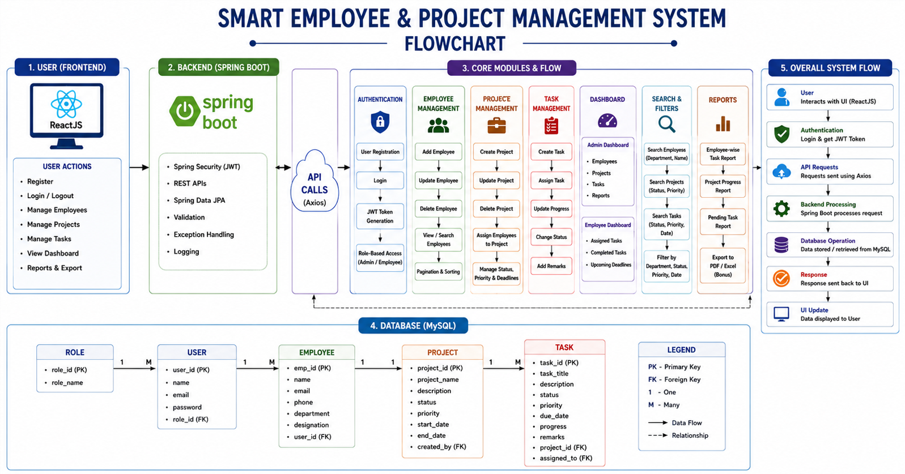
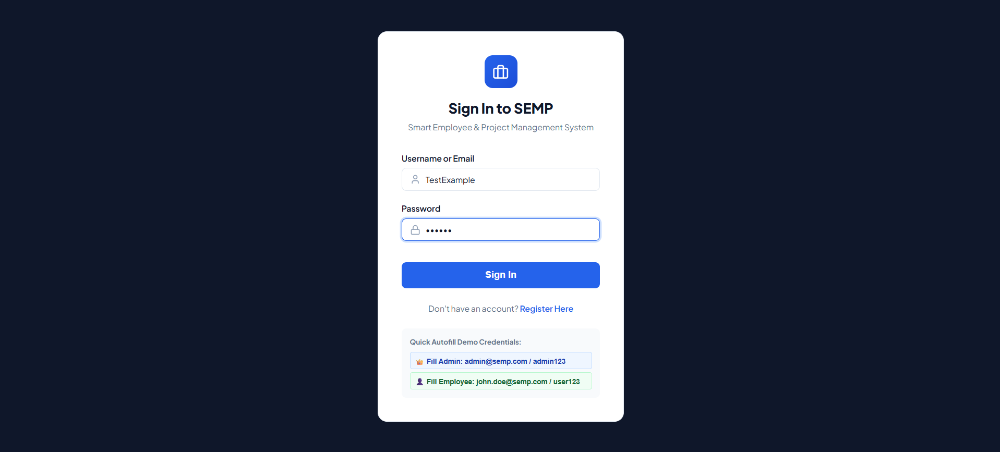
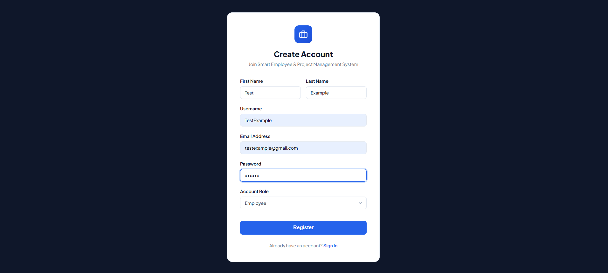
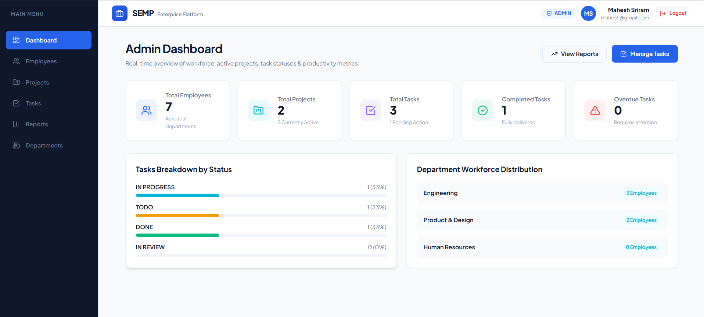
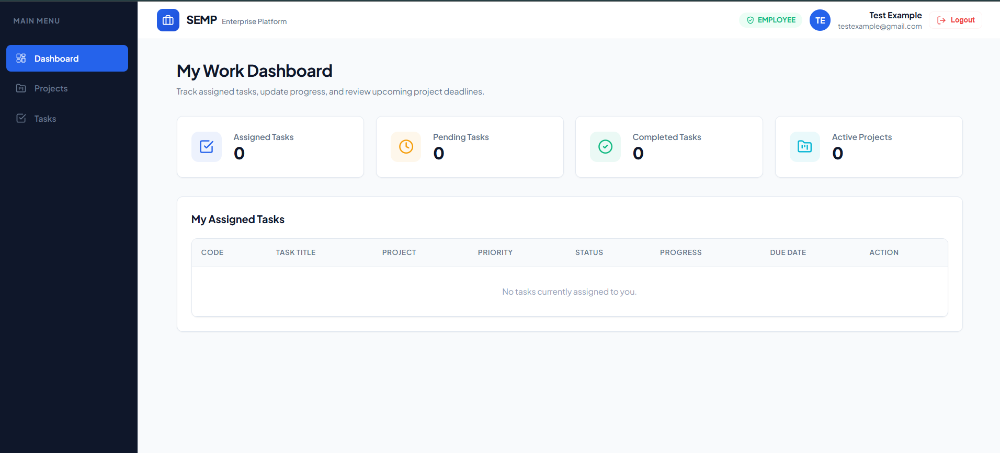
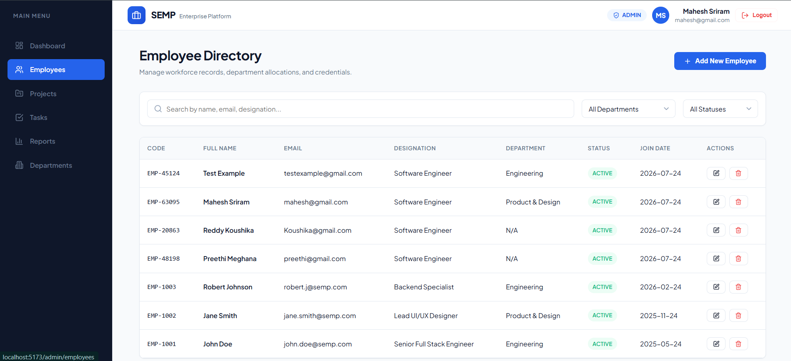
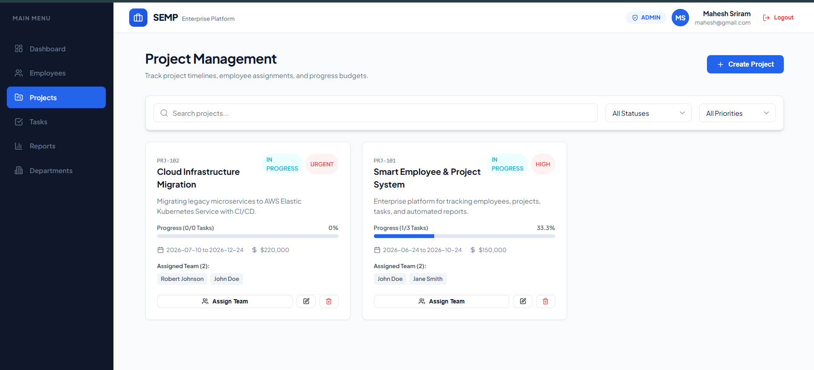
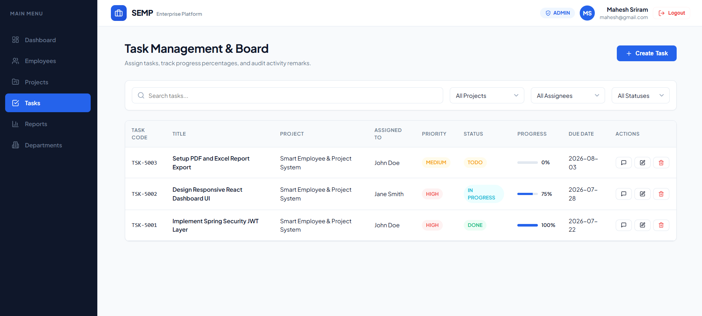
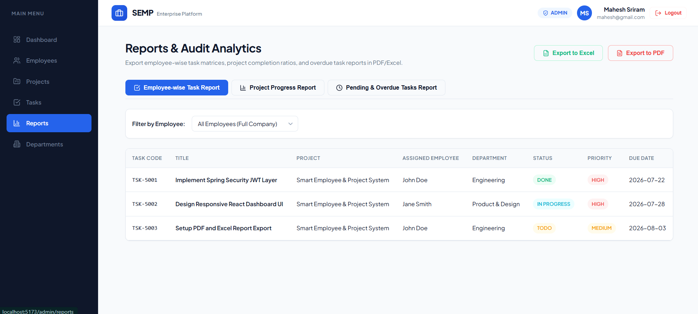
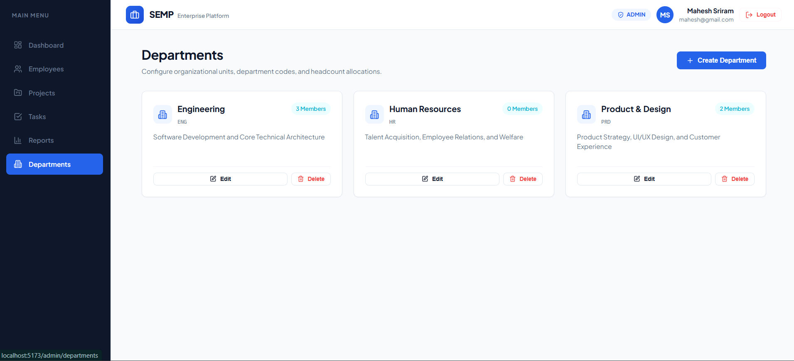

# Smart Employee & Project Management System (SEMP)


**SEMP (Smart Employee & Project Management System)** is an enterprise-grade full-stack web application built with **ReactJS** and **Spring Boot**. It offers complete workforce tracking, multi-project allocation, task board management with progress tracking and remark auditing, real-time metrics dashboards, and automated report generation in **PDF** and **Excel** formats.

---

# Smart Employee & Project Management System

## System Flowchart



## Application Screenshots
The application provides authentication, employee management, project management, task tracking, dashboard visualization, search and filtering, and reporting features.

### 1. 🔐 Login Page

The login page allows registered users to securely access the system using their email and password.


### 2. 📝 Register Page

The new users can create an account by providing the required details. The registration process validates user information before creating the account.


### 3. 📊 Role-Based Dashboard

The Admin dashboard provides an overview of important system information such as employees, projects, tasks, and reports. The displayed information depends on the user's role and access permissions.


The Employee Dashboard provides employees with a personalized overview of their assigned work and current activities. Employees can view their assigned tasks, monitor completed tasks, track task progress, and upcoming deadlines.


### 4. 👥 Employee Management

The Employee Management module allows only authorized users to add, update, delete, view, and search employee records. Employees can also be organized and managed using search, pagination, and sorting features.


### 5. 📁 Project Management

The Project Management module enables authorized users to create and manage projects, assign employees.


The Project Management section with Employee access allows employees to view their assigned projects, monitor project status and priority, and track important deadlines and responsibilities.
.png)

### 6. ✅ Task Management

The Task Management module allows tasks to be created and assigned to employees. Users can update task progress, change task status, and add remarks for better task tracking.


The Task Management section with employee access allows employees to view their assigned tasks, update task progress, change task status, and add remarks, helping them effectively manage and track their responsibilities.
.png)

### 7. 📈 Reports

The Reports section provides useful information such as employee-wise task reports, project progress reports, and pending task reports. Also downloadable as PDF & Excel report exports. 


### 8. 🏢 Department

The Department Management feature organizes employees based on their respective departments and enables efficient searching and filtering of employee records.



## 🌟 Key Features

1. **Authentication & Security**
   - User Registration, Login, and Logout.
   - Stateless **JWT (JSON Web Token)** Bearer authentication.
   - **BCrypt (Strength 12)** password hashing.
   - **Role-Based Access Control (RBAC)**: `ROLE_ADMIN` and `ROLE_EMPLOYEE`.

2. **Employee Management**
   - Full CRUD operations with code, department, salary, join date, and user account creation.
   - Advanced multi-criteria search, department filtering, and pagination.

3. **Project Management**
   - Create, update, and track project status (`NOT_STARTED`, `IN_PROGRESS`, `ON_HOLD`, `COMPLETED`), priority, and budget.
   - Assign/unassign team members (Many-to-Many relationship).

4. **Task Management**
   - Create and assign tasks to employees under projects.
   - Real-time progress updates (0-100%) and task status transitions (`TODO`, `IN_PROGRESS`, `IN_REVIEW`, `DONE`).
   - Chronological remark/comment audit thread on tasks.

5. **Dashboards**
   - **Admin Dashboard**: Real-time workforce metrics, project completion percentages, overdue task warnings, and department distribution.
   - **Employee Dashboard**: My assigned tasks, progress update sliders, and upcoming project deadlines.

6. **Reports & Exports (Bonus)**
   - Employee-wise task reports, Project progress reports, and Pending task reports.
   - Single-click export to **Formatted Excel (`.xlsx`)** using Apache POI.
   - Single-click export to **Formatted PDF (`.pdf`)** using OpenPDF.

---

## 🛠️ Technology Stack

| Layer | Technology |
|---|---|
| **Frontend** | ReactJS (v18), Vite, React Router (v6), Axios, Lucide Icons, Modern CSS Design System |
| **Backend** | Java 17+, Spring Boot (3.2.3), Spring Security 6, Spring Data JPA, Hibernate, Validation (`jakarta.validation`) |
| **Security** | JJWT (`0.11.5`), BCrypt Password Encoder |
| **Reporting** | Apache POI (`5.2.5`), OpenPDF (`1.3.32`) |
| **Database** | MySQL 8.x / H2 In-Memory (Zero-config out of the box) |
| **Build Tools** | Maven, Node.js & NPM |

---

## 📁 Repository Structure

```
SEMP/
├── backend/                        # Spring Boot Maven Project
│   ├── src/main/java/com/semp/
│   │   ├── config/                 # SecurityConfig, CorsConfig, DataInitializer
│   │   ├── controller/             # Auth, Employee, Project, Task, Report, Dashboard Controllers
│   │   ├── dto/                    # Request & Response DTOs with validation
│   │   ├── exception/              # GlobalExceptionHandler & Custom Exceptions
│   │   ├── model/                  # JPA Entities (User, Employee, Department, Project, Task, Remark)
│   │   ├── repository/             # Spring Data JPA Repositories
│   │   ├── security/               # JwtTokenProvider, JwtAuthFilter, UserPrincipal
│   │   ├── service/                # Business Service Interfaces & Implementations
│   │   └── util/                   # Excel & PDF Report Generators
│   ├── src/main/resources/
│   │   └── application.properties  # Database & JWT Application Configuration
│   └── pom.xml
├── frontend/                       # ReactJS Vite Project
│   ├── src/
│   │   ├── api/                    # Axios client & REST services
│   │   ├── components/             # Navbar, Sidebar, StatCard, Modal, Pagination, Badges
│   │   ├── context/                # AuthContext & ToastContext
│   │   ├── pages/                  # Admin & Employee Dashboards, Directory & Report Pages
│   │   ├── App.jsx
│   │   └── index.css               # Modern glassmorphism design system
│   ├── package.json
│   └── vite.config.js
├── database/
│   ├── schema.sql                  # MySQL/PostgreSQL DDL schema
│   └── sample_data.sql             # Seed data script
├── docs/
│   ├── ARCHITECTURE.md             # System Architecture & ER Diagram
│   ├── API_DOCUMENTATION.md        # Complete REST API reference
│   └── USER_GUIDE.md               # User manual & credentials
├── screenshots/
|   ├── Flowchart.png
|   ├── Login.png
|   ├── Register.png
|   ├── Admin Dashboard.png
|   ├── Employee Dashboard.png
|   ├── Departments.png
|   ├── Employees.png
|   ├── Projects.png
|   ├── Projects(Employee).png
|   ├── Reports.png
|   ├── Tasks.png
|   ├── Tasks(Employee).png|    
└── README.md                       # Master Documentation
```

---

## 🚀 Quickstart & Setup Guide

### Prerequisites
- **Java Development Kit (JDK 17 or higher)**
- **Node.js (v18 or higher)** & **NPM**
- Maven (or IDE with built-in Maven support)
- *(Optional)* MySQL Server (Version 8.0+)

---

### Step 1: Running the Backend (Spring Boot)

By default, the backend is pre-configured with an in-memory **H2 Database** so it starts instantly with **zero database configuration needed**.

1. Navigate to the backend directory:
   ```bash
   cd backend
   ```
2. Build and run using Maven:
   ```bash
   mvn spring-boot:run
   ```
   *Or open `backend/pom.xml` in IntelliJ IDEA / Eclipse / VS Code and run `SempApplication.java`.*

3. The backend will start on **`http://localhost:8080`**.
   - Seed data will be automatically populated.
   - H2 Console is accessible at `http://localhost:8080/h2-console` (JDBC URL: `jdbc:h2:mem:sempdb`, User: `sa`, Password: *blank*).

> **To switch to MySQL**:
> Open `backend/src/main/resources/application.properties`, uncomment the MySQL lines, update your MySQL username/password, and create the database `semp_db`.

---

### Step 2: Running the Frontend (ReactJS + Vite)

1. Open a new terminal and navigate to the frontend directory:
   ```bash
   cd frontend
   ```
2. Install dependencies:
   ```bash
   npm install
   ```
3. Start the Vite development server:
   ```bash
   npm run dev
   ```
4. Open your browser and navigate to **`http://localhost:5173`**.

---

## 🔑 Test Credentials

| Role | Username / Email | Password | Access Rights |
|---|---|---|---|
| **Admin** | `admin@semp.com` (or `admin`) | `admin123` | Full CRUD, Assign Teams, Reports, Department Management |
| **Employee** | `john.doe@semp.com` (or `john.doe`) | `user123` | Employee Dashboard, My Tasks, Update Progress, Remarks |

---

## 📄 License & Documentation

For complete technical specifications, review:
- [ARCHITECTURE.md](docs/ARCHITECTURE.md)
- [API_DOCUMENTATION.md](docs/API_DOCUMENTATION.md)
- [USER_GUIDE.md](docs/USER_GUIDE.md)
- [schema.sql](database/schema.sql)
